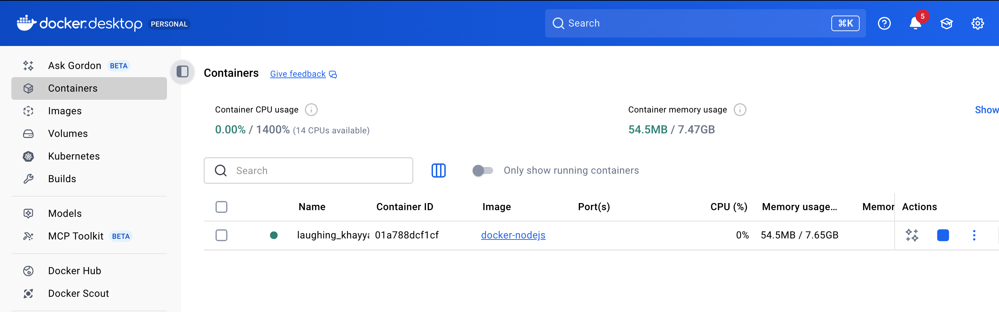

Docker Setup 

1. Creating a simple node application with main.js package.json and package-lock.json.
2. Writing instructions in Dockerfile to install Nodejs and copy Node application files and  dependencies into a docker image
3. Docker file instruction to create a docker image which contains Ubuntu as it's OS and Node 18.0 version installation guide

--Docker Commands to run the docker image--
4. docker run -it <name of the image>
5. docker run -it -p 8000:8000 <name of the image>

-- To access docker container that was created by that image --
6. docker exec -it <container id> /bin/bash

--Docker Compose yml --
is named as docker-compose.yml 
docker compose commands 
7. docker-compose up ( to start all the services )
8. docker-compose down ( to stop all the services )

   
